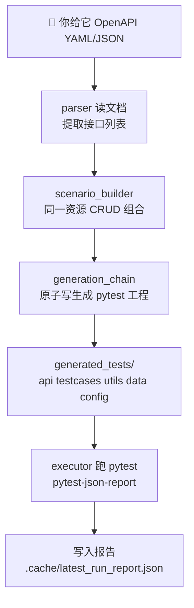
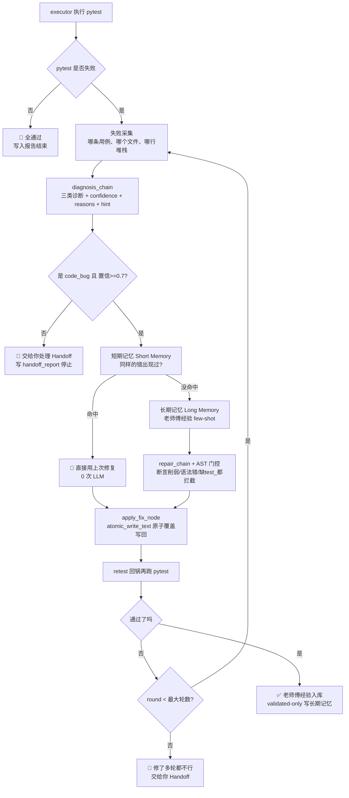

# API Test Agent Pro · 接口测试自动生成 + 自愈小助手

<div align="center">


> 🧰 一句话说明：你只要给它一份 **接口文档（OpenAPI / Swagger）**，它就能帮你**自动生成一整套可运行的 pytest 接口自动化工程**，然后自己跑、自己报错、自己识别错误，甚至**自动修复测试代码**（最多 3 轮），最后给你一份人能看懂的报告。

</div>

---

## 目录（Table of Contents）

> 先挑你最需要的看，不用从头到尾硬啃。

- [🎁 这个工具适合我吗？（30 秒判断）](#-这个工具适合我吗30-秒判断)
- [🧩 项目到底干了啥？（生活化比喻）](#-项目到底干了啥生活化比喻)
- [📦 它能解决我什么痛点？](#-它能解决我什么痛点)
- [✨ 功能一览（有什么能力）](#-功能一览有什么能力)
- [🧱 架构长啥样？（不写代码也能理解）](#-架构长啥样不写代码也能理解)
- [🚀 3 分钟快速开始（复制粘贴就能跑）](#-3-分钟快速开始复制粘贴就能跑)
- [🧪 使用示例：4 个最常见场景](#-使用示例4-个最常见场景)
- [⚙️ 配置怎么改？（一张表说清楚）](#️-配置怎么改一张表说清楚)
- [📁 每个文件夹 / 文件是什么意思？（目录白话说明）](#-每个文件夹--文件是什么意思目录白话说明)
- [🛠️ 技术栈对照表（面试、吹牛用）](#️-技术栈对照表面试吹牛用)
- [🧪 项目自带的"自测"（tests/ 是什么）](#-项目自带的自测tests-是什么)
- [🛡️ 代码健壮性（为什么它不会把你文件搞坏）](#️-代码健壮性为什么它不会把你文件搞坏)
- [🗺️ 路线图（未来要加什么）](#️-路线图未来要加什么)
- [❓ 常见问题 FAQ（99% 的坑在这里）](#-常见问题-faq99-的坑在这里)

---

## 🎁 这个工具适合我吗？（30 秒判断）

✅ **适合你，如果……**

- 你是学生 / 测试新人，想"一键生成接口测试工程"来练手或做作品集
- 你做接口自动化，但接口一改、用例批量挂，人工修到吐
- 你想做一个 **"接口测试 + LLM Agent"** 的项目去面试
- 你只想要结果，不想了解 LangGraph / ChromaDB 背后原理也能用

❌ **不适合你，如果……**

- 你期望它能帮你修复"后端代码 bug"（它只修测试代码，不会动你的业务服务）
- 你想在生产环境对真实流量做模糊测试（它是"生成+自愈"工具，不是渗透工具）

---

## 🧩 项目到底干了啥？（生活化比喻）

你可以把它当成一个 **"接口自动化 + 自动化厨师"**：

| 人能理解的步骤                                                                              | 工具里对应的步骤                                                                                                 |
| ------------------------------------------------------------------------------------------- | ---------------------------------------------------------------------------------------------------------------- |
| 📖 你给一本「菜单」（菜名 / 食材 / 做法规格）                                               | 你给一份 `openapi.yaml / swagger.json`（接口 URL / 参数 / 响应）                                                 |
| 🍳 厨师按菜单把「每道菜的菜谱」打印出来                                                     | 自动生成 **分层 pytest 工程**（`api/ testcases/ utils/ data/ config/ ...`）                                      |
| 🔥 厨师开始做菜，每道菜按菜谱验证                                                           | 自动运行 `pytest`，一条条跑接口用例                                                                              |
| 😵 某道菜做错了（盐放多了），自己判断：`是厨师锅炸了？还是菜单写错了？还是菜本身做法不对？` | 诊断失败分类：`code_bug / api_bug / env_bug` + 置信度 + 下一步建议                                               |
| ✂️ 高置信的"厨师写错菜谱"自己改菜谱                                                         | 只对高置信 `code_bug` 自动修复：短期记忆直接用旧答案 → 长期记忆搜经验 → LLM 重写失败文件 → 回锅再做（最多 3 次） |
| 📝 做完之后给你一张「出餐报告」：哪些菜成功、哪些交给你了、为什么                           | 写一份 `.cache/latest_run_report.json` + CLI / Streamlit / Claude Code Skill 三种方式读                          |

---

## 📦 它能解决我什么痛点？

传统接口自动化 4 大痛，这个工具都有解：

| 你可能遇到的坑                                      | 本工具怎么搞定                                                                                                          |
| --------------------------------------------------- | ----------------------------------------------------------------------------------------------------------------------- |
| **写用例太慢**：新接口一出来，一个一个写要一周      | `OpenAPI → 场景 → pytest 工程` 一键生成，接口秒变用例                                                                   |
| **维护成本巨高**：后端一迭代，用例批量挂            | **自动自愈闭环**：同类错误下次 0 LLM 秒命中，越用越快                                                                   |
| **越修越烂**：AI 为了让用例通过，把断言删得一干二净 | **三层保护**：诊断置信度 < 0.7 根本不进修复；修复后门控拦截"断言少了、没测试函数、语法错"；落盘走原子写不会毁文件       |
| **报错看不懂**：堆栈 + 乱码，新人直接懵             | **统一错误 + 可操作提示**：它不会只甩 traceback，而是告诉你"你先启动 mock 服务"、"你检查一下输入 YAML 是否存在"这种人话 |

---

## ✨ 功能一览（有什么能力）

> 💡 新手不用全记住，先记住：**它能"生成测试" + "自动修测试" + "给你报告"** 就够了。

- ✅ **读懂接口文档**：YAML / JSON 两种 OpenAPI/Swagger 都能吃，自动识别 method/path/headers/body/responses
- ✅ **组合成可跑的场景**：按资源（如 `/pets`、`/orders`）聚合 CRUD，避免"孤立接口"跑不通（创建 -> 查询 -> 列表 -> 更新 -> 删除）
- ✅ **生成分层 pytest 工程**：目录结构跟企业框架一模一样（`api/ testcases/ utils/ data/ config/ reports/ conftest.py pytest.ini`），拿去二次开发也顺手
- ✅ **结构化地跑用例**：使用 `pytest + pytest-json-report`，失败的用例、哪一行、堆栈、stdout、stderr 全部结构化
- ✅ **智能失败分类**：
  - `code_bug`：测试代码写坏了（例如 schema 断言写错）
  - `api_bug`：接口返回和文档不一致（是服务端 bug，不要乱修测试）
  - `env_bug`：服务没起、端口不通、鉴权失败（环境问题）
- ✅ **诊断置信度 + 下一步建议**：每次分类都带 `confidence（0~1） / reasons（为什么这么分） / actionable_hint（你下一步该干什么）`
- ✅ **短期记忆 Short Memory**：**同一个文件 + 同一种错误签名** = 直接复用上次修复，**0 次 LLM 调用**（免费又快）
- ✅ **长期记忆 Long Memory**：Chromadb 里只存"回归通过了的修复案例"（validated-only），像个老师傅经验库，few-shot 给 LLM 越修越准
- ✅ **修复安全门控 AST Guardrails**：
  - 修复后断言数量比原来少 → **拒绝落盘**（防止削弱型修复）
  - 修复后找不到 `def test_xxx` 函数 → **拒绝落盘**
  - 修复后文件存在 Python 语法错误 → **拒绝落盘**
- ✅ **原子写防半毁**：中途 Ctrl+C、磁盘异常都不会把你文件写成"半截"
- ✅ **统一错误 + 异常时也写报告**：任何业务异常都转成"你能懂的下一步操作"，并且写一份结构化 handoff 报告
- ✅ **三种入口，按你习惯来**：CLI（命令党）/ Streamlit（可视化党）/ Claude Code Skill（自然语言党）
- ✅ **开箱可演示**：内置 `mock_api_server.py` + `data/petstore.yaml`，你 clone 下来不用真实后端也能演示完整闭环

---

## 🧱 架构长啥样？（不写代码也能理解）

### 整体架构分层（从上到下：你 → 它 → 产物）

```text
┌───────────────────────────────────────────────────────────────┐
│                    👆 你能用的三种入口                          │
│   CLI（命令行 cli.py） Streamlit（网页 app.py） Claude Skill   │
└───────────────────────────┬───────────────────────────────────┘
                            │ 你按下"开始"
                            ▼
┌───────────────────────────────────────────────────────────────┐
│             🧠 Agent 大脑（LangGraph 状态机）                  │
│                                                               │
│   runner.py（总指挥） →  nodes.py（每个具体动作）              │
│                              │                                │
│                              ▼                                │
│                        router.py（分岔路口）                  │
│                        state.py（共享记忆本）                  │
└───────────────┬─────────────────────────┬─────────────────────┘
                │ 解析/生成/执行/诊断/修复    │ 记忆检索
                ▼                         ▼
┌─────────────────────────────┐  ┌──────────────────────────────┐
│   💪 能力链 Chains           │  │   🧠 双层记忆 Memory         │
│   · parser 读接口文档        │  │  · Short Memory 短期记忆     │
│   · generation_chain 生成工程│  │    （同样错误直接命中）      │
│   · diagnosis_chain 诊断错误 │  │  · Long Memory 长期记忆      │
│   · repair_chain 修测试代码  │  │    （老师傅经验库 ChromaDB） │
│   · executor 跑 pytest       │  │  · retriever 召回 few-shot   │
│   · signatures 错误指纹      │  │                              │
└─────────────────────────────┘  └──────────────────────────────┘
                │
                ▼
┌───────────────────────────────────────────────────────────────┐
│                  📤 你最终拿到的产物                            │
│  generated_tests/（分层 pytest 工程，可直接二次开发）           │
│  .cache/latest_run_report.json（运行报告）                     │
│  handoff_report / repair_history（交给你的说明 + 修复历史）     │
└───────────────────────────────────────────────────────────────┘
```

### 流程图 1：生成工程（Generate）



### 流程图 2：自动修复（Heal）



---

## 🚀 3 分钟快速开始（复制粘贴就能跑）

> 💡 **如果你是纯新手，按顺序 0 → 1 → 2 → 3 → 4 全部复制，不要跳步。**

### 0) 先确认你电脑有什么

打开一个 **PowerShell 或 CMD**，依次执行：

```powershell
# 确认 Python 版本（需要 3.10 及以上，显示 3.10.x / 3.11.x / 3.12.x 都可以）
python --version

# 确认 pip 能用
python -m pip --version
```

如果你还没装 Python，去 `https://www.python.org/downloads/` 下一个 **Python 3.10+** 的稳定版，安装时**记得勾 "Add Python to PATH"**（最关键的一个勾）。

### 1) 把本仓库 clone 到本地（或者你已经下载好了就跳过）

```powershell
cd d:\
git clone git@github.com:hanxiwei/api_test_agent_pro.git python\LLM-agent\api_test_agent_02
cd d:\python\LLM-agent\api_test_agent_02
```

> ⚠️ 如果 `git clone` 报权限错，就换成 HTTPS 地址：
> `git clone https://github.com/hanxiwei/api_test_agent_pro.git python\LLM-agent\api_test_agent_02`

### 2) 安装依赖

```powershell
cd d:\python\LLM-agent\api_test_agent_02
python -m pip install -r requirements.txt
```

> 💡 国内装得慢就加镜像：
> `python -m pip install -r requirements.txt -i https://pypi.tuna.tsinghua.edu.cn/simple`

### 3) 启动一个"假后端"（mock 服务）—— 必做！

项目里为了让你不用真实后端也能演示，自带了一个假后端：

**打开一个新的 PowerShell 窗口（后面这个窗口就别关了），执行：**

```powershell
cd d:\python\LLM-agent\api_test_agent_02
python mock_api_server.py
```

显示类似 `Running on http://127.0.0.1:8000` 就算启动成功。保持这个窗口打开（别关）。

然后回到你**第一个 PowerShell 窗口**，验证 mock 活着：

```powershell
python -c "import requests; print(requests.get('http://127.0.0.1:8000/pets').status_code)"
# 显示 200 就 OK
```

### 4) 配置 LLM 环境变量（可选，但推荐配，自动修复效果更好）

在项目根目录复制 `.env.example` 为 `.env`（你直接用文件资源管理器复制粘贴改名最快）。

如果你用 **DeepSeek API**（OpenAI 兼容协议，国内方便），`.env` 里写：

```env
OPENAI_API_KEY=你的_deepseek_key_sk_xxxx
OPENAI_BASE_URL=https://api.deepseek.com
```

> 💡 **不配 LLM 也能跑**：生成工程是 100% 纯规则，不依赖任何 LLM。只有在"遇到从没见过的新错误、并且短期记忆也没命中"时才会需要 LLM，这时候系统会明确抛出 `LLMUnavailableError` 并写报告告诉你下一步。

### 5) 一键生成测试工程（最激动的一步）

回到第一个 PowerShell 窗口：

```powershell
cd d:\python\LLM-agent\api_test_agent_02
python cli.py generate -i data/petstore.yaml -o generated_tests
```

结束后，你会发现根目录多出一个 `generated_tests/`，它就是**可直接跑的分层 pytest 工程**。

先看看它长啥样（Windows 命令）：

```powershell
Get-ChildItem generated_tests
```

你能看到：`api/ config/ data/ reports/ testcases/ utils/ conftest.py pytest.ini`。

### 6) 执行并自动修复失败用例（如果有）

```powershell
python cli.py heal -t generated_tests
```

然后你就可以看它表演：运行 pytest → 如果失败 → 诊断 → 判断能不能修 → 高置信修 → 回锅再跑 → 最多 3 轮 → 给你报告。

### 7) 看最近一次报告

```powershell
python cli.py report
```

或者直接打开 `.cache/latest_run_report.json` 用 VSCode 看。

---

## 🧪 使用示例：4 个最常见场景

### 场景 1：普通 CLI 从 0 跑一遍端到端

```powershell
# 先确保 mock 服务窗口开着（见上面 3-3）
cd d:\python\LLM-agent\api_test_agent_02

# 1. 生成工程（指定 base_url 写死成 mock 的 8000）
python cli.py generate -i data/petstore.yaml -o generated_tests --base-url http://localhost:8000

# 2. 想"只执行不自愈"先看失败情况？
python -m pytest generated_tests -q

# 3. 想"失败就自动修、最多 5 轮、开长期记忆"？
python cli.py heal -t generated_tests -r 5 --enable-long-memory
```

### 场景 2：故意触发错误，看它给你的"人话提示"和 handoff 报告

> 你只看"这工具报错能不能看懂"，用下面这条最快。

```powershell
# 用一个不存在的 openapi 文件
python cli.py generate -i data/not_exists.yaml -o generated_tests 2>&1 | Out-Null

# 然后打开报告看（命令能直接显示 JSON）
python -c "import json, lang_agent.report as r; print(json.dumps(r.load_run_report(), indent=2, ensure_ascii=False))"
```

你会看到：

- `ok: false`
- `stopped_reason: "stopped_on_env_bug"`
- `handoff_report.error_type: "OpenAPIParserError"`
- `handoff_report.reason: "请检查输入文件是否存在且为合法的 OpenAPI 3.x 文档..."`（人话告诉你下一步）

### 场景 3：可视化网页操作（适合演示给别人看）

```powershell
python -m streamlit run app.py
```

会自动弹出浏览器，页面左侧边栏：

- 选 `data/petstore.yaml`
- 点 **「一键流水线」**
- 等进度条跑完，能看到：生成了多少文件、pytest 通过/失败、修复几轮、哪些交给你处理（handoff）

### 场景 4：Claude Code 里自然语言一句话驱动（最爽）

安装并打开 **Claude Code**，在项目根目录里直接说：

> 帮我走完整流水线：先确认 `http://localhost:8000` 这个 mock 服务是否活着，死了就先启动；再用 `data/petstore.yaml` 生成测试到 `generated_tests/`；接着执行 heal，失败就自动修；最后给我一份中文总结报告。

Claude 会自动发现 `.claude/skills/api-test-agent/SKILL.md` 这个 Skill，按你的话一步步做，不用记任何命令。

---

## ⚙️ 配置怎么改？（一张表说清楚）

配置默认文件是 `config.yaml`。**绝大多数时候你用默认值就行。** CLI 参数能覆盖表中任何一项。

| 配置项                      | 人话含义                         | 默认值                          | 什么时候需要改？                     |
| --------------------------- | -------------------------------- | ------------------------------- | ------------------------------------ |
| `openapi_path`              | 默认读哪份接口文档               | `data/petstore.yaml`            | 你想换成自己项目的 YAML              |
| `base_url`                  | 被你测的后端服务地址             | `http://localhost:8000`         | 要测真实后端时改成它的域名           |
| `output_dir`                | 生成的 pytest 工程目录           | `generated_tests`               | 嫌目录名不好看时改                   |
| `model.provider`            | LLM 提供商类型                   | `openai`                        | 默认就好（DeepSeek 也是兼容 OpenAI） |
| `model.name`                | 模型名                           | `deepseek-v4-pro`               | 你 API Key 是别的模型就改            |
| `model.temperature`         | LLM 创意度（0 越确定、1 越放飞） | `0`                             | 修代码建议保持 0                     |
| `heal.max_rounds`           | 最多修复几轮后交给人（熔断）     | `3`                             | 后端很复杂、愿意让它多试就加到 5     |
| `memory.enable_long_memory` | 开不开长期记忆老师傅库           | `false`                         | 想用 ChromaDB 越修越准就开 `true`    |
| `memory.long_memory_path`   | 长期记忆本地保存目录             | `.chroma_acceptance`            | 不建议改                             |
| `memory.short_memory_path`  | 短期记忆 JSON 路径               | `.cache/short_memory.json`      | 不建议改                             |
| `report.path`               | 运行报告落盘路径                 | `.cache/latest_run_report.json` | 不建议改                             |

想启用长期记忆时，参考项目里 `config.long_memory.yaml` 的注释把 embedding 相关配置也补上。

---

## 📁 每个文件夹 / 文件是什么意思？（目录白话说明）

### 1. 核心源代码（`lang_agent/`）

```text
lang_agent/
├── chains/                         🔨 干活的能力链
│   ├── generation_chain.py           —— 生成一套分层 pytest 工程（原子写）
│   ├── diagnosis_chain.py            —— 判断失败是 code/api/env 哪类 + 置信度/原因/提示
│   ├── repair_chain.py               —— 修失败测试代码 + AST 门控（防止乱修）
│   ├── prompts.py                    —— 所有 prompt 模板（想改 LLM 行为改这里）
│   └── llm_factory.py                —— 模型工厂（统一加载兼容 ChatOpenAI）
├── graph/                          🧠 LangGraph 状态机大脑
│   ├── runner.py                     —— 总指挥官（run_generate / run_heal + 异常兜底写报告）
│   ├── nodes.py                      —— 每个原子动作（parse/run_tests/classify/apply_fix/retest…）
│   ├── router.py                     —— 分岔路口：失败走哪条、置信度低于阈值直接 handoff
│   └── state.py                      —— 共享小本本：整个流程的状态都存在这里
├── memory/                         🧠 记忆
│   ├── short_memory.py               —— 短期记忆：同样错误直接命中（免费）
│   ├── long_memory.py                —— 长期记忆：老师傅经验库（ChromaDB，validated-only 写）
│   └── retriever.py                  —— 从长期记忆里挑几个相似案例给 LLM 当示范
├── parser.py                         解析 OpenAPI（不合法/不存在就 OpenAPIParserError 报人话）
├── executor.py                       跑 pytest 子进程（异常退出码给你可操作提示）
├── scenario_builder.py               Endpoint → 同一资源 CRUD 场景组合
├── signatures.py                     给错误算"指纹"（短期记忆靠它命中）
├── report.py                         RunReport/HealReport 的保存/加载
├── config.py                         把 config.yaml + .env 读到 Pydantic 对象里
└── utils.py                          ⭐ 最底层的两个关键能力：
                                       ① atomic_write_text（原子写，不会写坏文件）
                                       ② 统一异常家族（带 user_hint + details）
```

### 2. 本项目的自测（`tests/`）

> 重要：`tests/` 里的代码是**测这个工具本身**的，不是你对外生成的接口测试！

```text
tests/
├── test_parser.py                    测解析器能不能正确读 YAML/JSON
├── test_report.py                    测报告保存/加载
├── test_router.py                    测路由（分类/置信度 handoff/max_rounds 熔断）
├── test_signatures.py                测错误签名 hash
├── test_long_memory.py               测长期记忆（validated-only 写入/兜底检索/降级 no-op）
└── test_utils_robustness.py          ⭐ 最能打的两个健壮性用例：
                                        · 原子写写失败仍保留旧内容 + 临时文件清理
                                        · 业务异常自动转 handoff_report 并落盘
```

### 3. 其他入口 / 配置

| 路径                                        | 你什么时候会碰它                                  |
| ------------------------------------------- | ------------------------------------------------- |
| `cli.py`                                    | 命令行入口（generate / heal / report）            |
| `app.py`                                    | Streamlit 网页入口（一键流水线 + 报告展示）       |
| `mock_api_server.py`                        | 假后端：本地演示时它必须开一个窗口跑              |
| `data/petstore.yaml`、`data/todo_demo.yaml` | 样例 OpenAPI 文档；你可以把自己的 YAML 放到这里   |
| `.env.example`                              | 环境变量示例：复制一份改名 `.env` 填 API Key      |
| `config.yaml`                               | 默认配置                                          |
| `config.long_memory.yaml`                   | 长期记忆 + embedding 配置参考                     |
| `requirements.txt`                          | 项目依赖清单（`pip install -r 它`）               |
| `pytest.ini`                                | pytest 基础设置                                   |
| `.gitignore`                                | 哪些东西不提交 Git（generated_tests / .cache 等） |
| `docs/21天复写计划-API-Test-Agent.md`       | 你面试前的 21 天复写计划（学习路径 + 练习点）     |
| `.claude/skills/api-test-agent/SKILL.md`    | Claude Code Skill 定义（打开项目就会被自动发现）  |

### 4. 可删除的产物目录（你可以随时删，随时再生成）

- `generated_tests/`：对外生成的分层 pytest 工程
- `.cache/`：运行报告、短期记忆缓存
- `.chroma_acceptance/`：启用长期记忆后生成的向量库

---

## 🛠️ 技术栈对照表（面试、吹牛用）

| 分类             | 用的技术                              | 它在这个项目里做什么                                                     |
| ---------------- | ------------------------------------- | ------------------------------------------------------------------------ |
| Agent 状态机编排 | **LangGraph**                         | 让生成/执行/诊断/记忆/修复像状态机一样串起来，能熔断、能分叉、能交接给人 |
| Prompt / LLM     | **LangChain + langchain-openai**      | 诊断链、修复链统一走 ChatOpenAI 兼容协议，方便你换模型                   |
| 长期记忆向量库   | **ChromaDB**                          | 只存"真修成功了"的修复案例（validated-only），越修越准                   |
| OpenAPI 解析     | **Prance**                            | 支持 YAML/JSON，解析前先校验                                             |
| 用例执行         | **pytest + pytest-json-report**       | 执行接口用例 + 结构化失败采集（失败行号、堆栈、stdout/stderr 都有）      |
| 重试兜底         | **tenacity**                          | LLM 调用、网络不稳时自动重试                                             |
| 命令行工具       | **Click**                             | generate / heal / report 子命令                                          |
| 网页看板         | **Streamlit**                         | 0 前端也能做可视化一键流水线                                             |
| 配置             | **PyYAML + python-dotenv + Pydantic** | 读 `config.yaml` 和 `.env`，类型安全                                     |
| HTTP             | **requests**                          | mock 健康检查 + 生成的测试工程里的 API 客户端                            |
| 自然语言交互     | **Claude Code Skill**                 | 写一次 Skill，以后直接说中文就能驱动整个流水线                           |

---

## 🧪 项目自带的"自测"（tests/ 是什么）

### 跑项目自测（验证工具本身有没有坏）

```powershell
pytest tests -q
```

当前项目基线：**13 passed**（2026-09-10，commit `9d800a6` 以后）。

### 自测覆盖的能力

| 模块          | 用例文件                         | 覆盖点（人话）                                                                                    |
| ------------- | -------------------------------- | ------------------------------------------------------------------------------------------------- |
| 解析器        | `tests/test_parser.py`           | YAML/JSON 能读吗、接口列表能提取吗                                                                |
| 报告          | `tests/test_report.py`           | 报告保存/加载/序列化 OK 吗                                                                        |
| 路由          | `tests/test_router.py`           | 分类对不对？置信度 < 0.7 真的会 handoff？max_rounds 真会熔断？                                    |
| 错误签名      | `tests/test_signatures.py`       | 同一个错误，签名稳定吗                                                                            |
| 长期记忆      | `tests/test_long_memory.py`      | validated-only 真的写？兜底检索能用吗？没开时真的降级 no-op 吗                                    |
| **健壮性 ⭐** | `tests/test_utils_robustness.py` | ① 写过程磁盘异常不会把旧文件搞坏 + 临时文件会清理 ② 业务异常真的会转成结构化的 handoff 报告并落盘 |

---

## 🛡️ 代码健壮性（为什么它不会把你文件搞坏）

> 💡 很多 AI 工具"修着修着把工程改崩了"。这个项目为什么不？因为它有三层保护。

### 保护 1：统一原子写（Ctrl+C 中途退出也不会写半截）

所有"写入 generated_tests / 回写修复"都走 `atomic_write_text()`：

```text
① 在同一目录下创建一个临时文件
② 把内容 write 进去 → flush → fsync（强制刷到磁盘）
③ 再用 os.replace 原子重命名（要么成功替换，要么还是旧文件）
④ 任何异常：临时文件自动删除，旧文件一丝不动
```

- 实现位置：`lang_agent/utils.py` 的 `atomic_write_text()`
- 测试证据：`tests/test_utils_robustness.py` 里的 3 个用例（正常覆盖、写失败保留旧内容、父目录不存在也能写）

### 保护 2：诊断置信度门控（"我不确定就绝对不乱修"）

诊断结果现在强制是结构化 JSON：

```json
{
  "category": "code_bug",
  "confidence": 0.82,
  "reasons": [
    "断言预期字段名和实际 API schema 不匹配",
    "堆栈指向 testcases/xxx.py 的第 42 行断言语句",
    "同组其他用例的字段命名一致"
  ],
  "actionable_hint": "先 curl 一次真实 API 看 200 响应字段到底是 petStatus 还是 pet_status，确认后再让 LLM 改"
}
```

路由规则：

- `code_bug 且 confidence < 0.7` → **直接交给你（handoff）**，不进修复
- 老状态没传 `confidence` → 兼容放行（不搞破坏性升级）
- `api_bug / env_bug` → 一律交给你（这类本来就不应该修测试代码）

- 实现位置：`lang_agent/graph/router.py` 的 `route_after_classification()`
- 测试证据：`tests/test_router.py` 的 `test_route_after_classification_confidence_gate`

### 保护 3：统一异常家族 + runner 兜底（出错了也写报告给你看，不甩 traceback）

| 异常类                   | 会在什么时候弹你                                                  |
| ------------------------ | ----------------------------------------------------------------- |
| `OpenAPIParserError`     | 你给的 YAML 不存在 / 格式不对 / 不是合法 OpenAPI                  |
| `TestRunnerError`        | pytest 进程出现奇怪退出码，工具拿不到结构化报告                   |
| `LLMUnavailableError`    | 没配 API Key 或模型调用失败（并告诉你去 .env 配）                 |
| `DiagnosisBlockedError`  | 诊断链死活给不出分类                                              |
| `RepairGateBlockedError` | AST 门控拦截：它发现 LLM 把断言削弱了 / 没写 test\_ 函数 / 语法错 |

更关键的是 **runner 兜底**：不管 generate 还是 heal，只要抛出上面的错误，都会自动：

1. 把它转成一份结构化的 `handoff_report`（category / error_type / reason / details）
2. 把整份 `RunReport` 写到 `.cache/latest_run_report.json`
3. CLI / Streamlit / Skill 读这份报告，告诉你"下一步你该做什么"（人话）

- 实现位置：`lang_agent/graph/runner.py` 的 `_build_handoff_from_exception()`
- 测试证据：`tests/test_utils_robustness.py` 的 `test_handoff_report_written_when_base_error_raised`

---

## 🗺️ 路线图（未来要加什么）

### P0（当前已交付 ✅，你 clone 下来就能用）

- [x] OpenAPI → Scenario → 分层 pytest 工程全链路
- [x] pytest 结构化失败采集
- [x] 三类失败诊断（code_bug / api_bug / env_bug）
- [x] 诊断置信度 / reasons / actionable_hint + 低置信度 handoff
- [x] 短期记忆 Short Memory（同样错误 → 0 LLM）
- [x] 长期记忆 Long Memory（ChromaDB + validated-only）
- [x] AST 门控：断言削弱 / 缺 test\_ / 语法错 拦截
- [x] 原子写 + 统一异常 + runner 兜底 handoff 报告
- [x] CLI / Streamlit / Claude Code Skill 三种入口
- [x] 13 个项目自测全绿

### P1（下一批高 ROI，校招简历/项目"持续迭代"叙事最好用）

- [ ] **统一 LLM 门面 + 优雅降级**：把诊断/生成/修复各自的 retry decorator 收归一处，超时/失败自动 fallback 到 heuristic
- [ ] **CI（GitHub Actions）**：PR 自动跑 `pytest tests -q` + generate 冒烟 + 上传报告 Artifact
- [ ] **离线评测集 + 指标**：`evaluation/` 放 20~30 条带标签的错误样本，统计 heal 成功率 / handoff 率 / 误修率 / LLM 调用次数
- [ ] **轨迹追踪 TrajectoryTracker**：每一步的输入输出落盘 `.cache/trajectory/{run_id}.jsonl`，方便事后回放、调门控阈值
- [ ] **上下文管理器 ContextManager**：把 run_id、trace_id、用户、环境、target_url 打包，日志和报告一次带齐
- [ ] **更严格的 AST 断言门控**：不只是"断言数下降"，还能识别"把 `assert data['id']==1` 改成 `assert data` 这种削弱型修复"

### P2（锦上添花，面试"未来规划"部分可以吹）

- [ ] **MCP Server**：把 generate / heal / report 暴露成 MCP Tools，任意 LLM 宿主都能调用
- [ ] **可观测性**：接入 OpenTelemetry + LangGraph tracing，配合 Prometheus/Grafana
- [ ] **Stamina 重试**：生成的测试用例在 flaky 场景用 `stamina` 装饰器重试
- [ ] **CTRF 报告格式**：输出 Common Test Report Format，对接 DevOps 通用大盘
- [ ] **UI 升级**：Streamlit 看板支持修复 diff、人工"接受/拒绝修复"、LLM 输入输出可视化
- [ ] **录制即文档即测试**：从 HAR 录制 → 生成 OpenAPI → 生成测试，一条龙

---

## ❓ 常见问题 FAQ（99% 的坑在这里）

### 1. 报错：`无法连接到 localhost:8000` / `目标计算机拒绝连接`

**99% 原因**：你没开 `mock_api_server.py` 的窗口，或者关掉了。  
**解决**：

```powershell
# 新开一个 PowerShell 窗口（这个窗口跑全程别关）
cd d:\python\LLM-agent\api_test_agent_02
python mock_api_server.py
```

或者你测真实后端，就把 `config.yaml` 或 Streamlit 侧边栏里的 `base_url` 改成真实后端地址。

### 2. 报错：`invalid_api_key` / `401 Unauthorized`

**原因**：`.env` 里 `OPENAI_API_KEY` 填错了 / 没配，或者 `model.name` 和你的 Key 不匹配。  
**解决**：

- 检查 `.env` 存在且 `OPENAI_API_KEY=sk-xxx` 没引号、没多余空格
- 检查 `OPENAI_BASE_URL` 对不对（DeepSeek 是 `https://api.deepseek.com`）
- 检查 `config.yaml` 的 `model.name` 是不是你的 Key 支持的模型

### 3. `generated_tests/` 里怎么混着老的平铺 `test_xxx.py`？

**原因**：你以前跑过老版本的 generate，目录有残留。  
**解决（最暴力最有效）**：

```powershell
# Windows PowerShell 直接删整个目录
Remove-Item -Recurse -Force generated_tests
# 然后重新生成：
python cli.py generate -i data/petstore.yaml -o generated_tests
```

### 4. 不配置 LLM（没有 API Key）到底能不能用？

**完全能用。**

- **生成链路** 是 100% 纯规则生成工程，不需要任何 LLM
- **自愈链路**：只有遇到"短期记忆没命中"的全新错误才会去调 LLM；此时会抛 `LLMUnavailableError` 并写报告告诉你需要配 Key

想零成本体验项目？**你不配 Key 也能跑完 generate、能跑 pytest、能看它报结构化错误、能看短期记忆命中场景。**

### 5. Claude Code 里 Skill 没出现 / 没识别？

重启 Claude Code 会话或重新在项目根目录打开项目，确认存在：

```text
.claude/skills/api-test-agent/SKILL.md
```

### 6. 我想让它"先修一次给我看"，但我没有自己的后端怎么办？

就用项目自带的 **mock_api_server.py** 当后端，配合 3 分钟快速开始里的 3 → 5 → 6 步骤，它能稳定演示：生成 → 跑 →（如果你手动改坏某个用例 → 再触发 heal）→ 修复。

手动破坏一个用例的最快方法：打开 `generated_tests/testcases/xxx.py`，把某个断言从 `assert r.status_code == 200` 改成 `assert r.status_code == 299`，再跑 `python cli.py heal -t generated_tests` 就能看到它表演识别与修复。

---

<div align="center">

**Made for 2026 SDET / 测开作品集 · 接口自动化 × LLM Agent × LangGraph Harness**

喜欢请点 GitHub ⭐ Star 支持一下：`https://github.com/hanxiwei/api_test_agent_pro`

</div>
