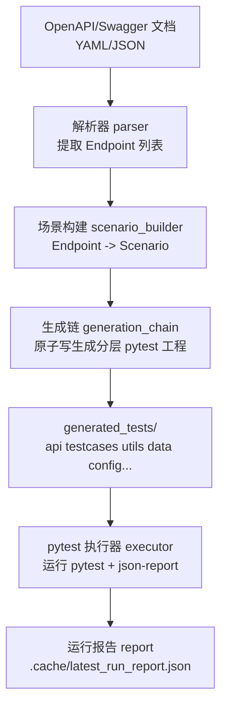
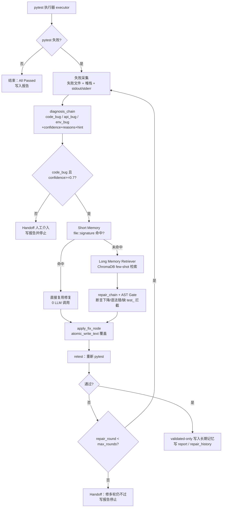

# API Test Agent Pro

<div align="center">


**从一份 OpenAPI/Swagger 文档 → 自动生成分层 pytest 工程 → 执行失败 → 分类 → 自动自愈，端到端的接口自动化 + LLM 自修复 Agent。**

</div>

---

## 目录（Table of Contents）

- [项目简介](#项目简介)
- [项目背景 / 解决什么问题](#项目背景--解决什么问题)
- [功能特性](#功能特性)
- [架构与流程图](#架构与流程图)
- [快速开始](#快速开始)
- [使用示例](#使用示例)
- [配置说明](#配置说明)
- [项目结构](#项目结构)
- [技术栈](#技术栈)
- [测试](#测试)
- [代码健壮性（Robustness）](#代码健壮性robustness)
- [路线图 Roadmap](#路线图-roadmap)
- [常见问题 FAQ](#常见问题-faq)

---

## 项目简介

API Test Agent Pro 是一个面向 **SDET / 测开工程师 / AI Infra 开发者** 的工具：你只需丢一份 `openapi.yaml / swagger.json`，它会自动：

1. 解析接口定义 → 构建 CRUD 场景
2. 生成一套"企业级分层"的 `pytest` 工程（`api / testcases / utils / data / config / reports`）
3. 跑 pytest 并采集失败上下文
4. 对失败做三类诊断（`code_bug / api_bug / env_bug`）并给出置信度、原因、可操作提示
5. **仅对高置信 code_bug** 进入自动修复：短期记忆（同错 0 次 LLM）→ 长期记忆（ChromaDB few-shot）→ LLM 重写失败文件 → 回归验证，最多 3 轮
6. 回归通过才写入长期记忆（validated-only），并为 CLI / Streamlit / Claude Code Skill 暴露同一份结构化报告。

整个自愈内核使用 **LangGraph 状态机** 编排，支持门控、熔断、handoff，"不确定就不乱修"。

---

## 项目背景 / 解决什么问题

传统接口自动化有 4 个痛点，这个项目就是为了解决它们：

| 痛点                                                      | 本项目的解法                                                                                                                      |
| --------------------------------------------------------- | --------------------------------------------------------------------------------------------------------------------------------- |
| **写用例太慢**：新接口一出来，testcase 一个个写要一周     | `OpenAPI → Scenario → pytest` 一键生成，按资源聚合 CRUD 场景，秒级出工程                                                          |
| **维护成本高**：接口一迭代，用例批量失败，人工挨个修      | **LLM 自愈闭环**：code_bug 自动修，最多 3 轮 + 记忆沉淀，下次同错直接命中                                                         |
| **乱修更可怕**：LLM 改错比没修还惨，断言被削弱还看不出来  | **三层保护**：诊断置信度门控（< 0.7 不进修复）+ 修复 AST 门控（断言少了/没测试函数/语法错直接拦截）+ 原子写（不会写坏文件）       |
| **报错看不懂**：堆栈 + 中文夹杂，新人根本不知道下一步干啥 | **统一异常体系 + 可操作 user_hint**：解析器、执行器、LLM、门控都抛结构化错误，runner 兜底写 `handoff_report`，CLI/UI 直接念给人听 |

面试叙事：它不是"让 GPT 改代码的玩具脚本"，而是一套"生成 + 执行 + 诊断 + 门控 + 记忆 + 展示"都有明确边界的 Agent Harness——**边界就是：能修的修，修不了的交给人，绝对不让系统越界**。

---

## 功能特性

- ✅ **OpenAPI/Swagger 解析**：YAML/JSON 自动提取 method/path/params/body/responses，自动构建 Endpoint 列表
- ✅ **智能场景构建**：按资源聚合 CRUD 接口（比如 `pets` 资源 = create → get → list → update → delete），避免孤立接口无前置数据
- ✅ **分层 pytest 工程生成**：输出 `api/ testcases/ utils/ data/ config/ reports/ conftest.py pytest.ini`，目录结构跟企业自动化框架一模一样
- ✅ **结构化失败采集**：`pytest-json-report` → 失败用例、失败文件路径、行号、堆栈、stdout/stderr 全部结构化
- ✅ **三类失败诊断**：`code_bug`（用例本身问题）/ `api_bug`（接口返回和文档不一致）/ `env_bug`（服务没起、网络、鉴权）
- ✅ **诊断置信度 + 可操作提示**：每个诊断都带 `confidence / reasons / actionable_hint`，低置信直接 handoff
- ✅ **短期记忆 Short Memory**：同一文件 + 同一错误签名 → 直接复用上次修复，**0 次 LLM 调用**
- ✅ **长期记忆 Long Memory**：ChromaDB 向量检索 validated-only 的修复案例作为 few-shot，越修越聪明
- ✅ **修复门控 AST Guardrails**：断言数量下降 / 缺 `def test_` 函数 / 语法错误 → **拒绝落盘**
- ✅ **原子写防半写**：生成和修复的文件落盘全部 `tempfile + fsync + os.replace`，中途 Ctrl+C 不会毁文件
- ✅ **统一异常 + Handoff 报告**：所有关键错误都转成结构化 `handoff_report`，异常时也写 `latest_run_report.json`
- ✅ **三种入口**：Click CLI / Streamlit 看板 / **Claude Code Skill**（推荐，自然语言直接驱动）
- ✅ **可复现实验环境**：内置 `mock_api_server.py` + `data/petstore.yaml`，clone 下来即能演示

---

## 架构与流程图

### 整体架构分层

```text
┌───────────────────────────────────────────────────────────────┐
│                    入口层 Entry Layer                          │
│   CLI (cli.py)   Streamlit (app.py)   Claude Code Skill       │
└───────────────────────────┬───────────────────────────────────┘
                            │ invoke
                            ▼
┌───────────────────────────────────────────────────────────────┐
│                  Agent Harness（LangGraph）                    │
│  runner.py  ─▶  nodes.py   ─▶   router.py  ─▶  state.py       │
│  编排 & 异常兜底    原子节点执行      分支路由       共享状态    │
└───────────────┬─────────────────────────┬─────────────────────┘
                │ 解析/生成/执行/诊断/修复    │ 记忆检索
                ▼                         ▼
┌─────────────────────────────┐  ┌──────────────────────────────┐
│        Chains 能力链         │  │      Memory Layer 记忆层      │
│  parser / generation_chain   │  │  short_memory（错误签名 KV）  │
│  diagnosis_chain / repair    │  │  long_memory（ChromaDB 向量） │
│  executor / signatures       │  │  retriever（few-shot 召回）   │
└─────────────────────────────┘  └──────────────────────────────┘
                │
                ▼
┌───────────────────────────────────────────────────────────────┐
│                    产物 & 报告 Artifacts                        │
│  generated_tests/（分层 pytest 工程）                          │
│  .cache/latest_run_report.json  handoff_report  repair_history │
└───────────────────────────────────────────────────────────────┘
```

### 1) 生成链路（Generate）



### 2) 自愈闭环（Heal）



---

## 快速开始

### 0) 环境要求

- Python **3.10** 及以上
- Windows / macOS / Linux 均可
- （可选）一个 OpenAI 兼容协议的 API Key（推荐 DeepSeek）

### 1) 安装依赖

```bash
python -m pip install -r requirements.txt
```

### 2) 启动本地 mock 服务（推荐先做）

本项目用 `data/petstore.yaml` 演示，`base_url` 默认期望 `http://localhost:8000`。先把 mock 起起来：

```bash
python mock_api_server.py
```

另开一个终端验证 mock 正常：

```bash
python -c "import requests; print(requests.get('http://127.0.0.1:8000/pets').status_code)"
```

### 3) 配置环境变量（可选但推荐）

复制 `.env.example` 为 `.env`：

```env
# DeepSeek（OpenAI 兼容协议）
OPENAI_API_KEY=sk-xxxx
OPENAI_BASE_URL=https://api.deepseek.com

# 可选：启用向量长期记忆时再配
# EMBEDDING_API_KEY=...
# EMBEDDING_BASE_URL=...
# EMBEDDING_MODEL=...
```

> 💡 不配置 LLM 也可以：**生成链路不依赖 LLM**（纯规则），只有 heal 里"没命中 short_memory"时才需要 LLM；此时会统一抛 `LLMUnavailableError` 并写 handoff 报告。

### 4) 一键生成 + 自愈

```bash
# 先生成分层 pytest 工程
python cli.py generate -i data/petstore.yaml -o generated_tests

# 再执行 + 失败自动自愈
python cli.py heal -t generated_tests
```

### 5) 查看最近报告

```bash
python cli.py report
```

报告真实文件就在 `.cache/latest_run_report.json`，Streamlit 和 Skill 都是读这份。

---

## 使用示例

### 示例 1：手动 CLI 端到端

```bash
# 1) 生成
python cli.py generate -i data/petstore.yaml -o generated_tests --base-url http://localhost:8000

# 生成的分层结构
ls generated_tests
# api/  config/  data/  reports/  testcases/  utils/  conftest.py  pytest.ini

# 2) 纯跑一次 pytest（不自愈）
python -m pytest generated_tests -q

# 3) 失败就自动修（最多 5 轮，开长期记忆）
python cli.py heal -t generated_tests -r 5 --enable-long-memory
```

### 示例 2：故意触发异常 → 看 handoff_report

```bash
# 输入文件不存在
python cli.py generate -i data/not_exists.yaml -o generated_tests 2>&1 || true

# 查看结构化报告
python -c "import json; print(json.dumps(__import__('lang_agent.report', fromlist=['load_run_report']).load_run_report(), indent=2, ensure_ascii=False))"
```

期望字段：

```json
{
  "ok": false,
  "stopped_reason": "stopped_on_env_bug",
  "handoff_report": {
    "category": "env_bug",
    "error_type": "OpenAPIParserError",
    "reason": "请检查输入文件是否存在...",
    "details": { "path": "..." }
  }
}
```

### 示例 3：Streamlit 可视化看板

```bash
python -m streamlit run app.py
```

进页面后走 **「一键流水线」**：选 `data/petstore.yaml` → 点开始 → 看自愈过程、修复轮数、handoff 信息全部可视化。

### 示例 4：Claude Code Skill（推荐 ⭐）

在 Claude Code 里直接说：

> 帮我用 `data/petstore.yaml` 走完整流水线：先启动 mock 服务，再生成测试到 `generated_tests/`，如果失败就自动修，最后给我一份中文报告。

Skill 路径：`.claude/skills/api-test-agent/SKILL.md`，打开项目就会自动被 Claude Code 发现。

---

## 配置说明

`config.yaml` 默认配置（所有字段都能被 CLI 参数覆盖）：

| 配置项                      | 说明                                 | 默认值                          |
| --------------------------- | ------------------------------------ | ------------------------------- |
| `openapi_path`              | 默认 OpenAPI 文档路径                | `data/petstore.yaml`            |
| `base_url`                  | 被测 API 服务地址                    | `http://localhost:8000`         |
| `output_dir`                | 生成的 pytest 工程目录               | `generated_tests`               |
| `model.provider`            | LLM 提供商（目前只实现 openai 兼容） | `openai`                        |
| `model.name`                | 聊天模型名                           | `deepseek-v4-pro`               |
| `model.temperature`         | 生成温度（修复建议保持 0）           | `0`                             |
| `heal.max_rounds`           | 单失败最大自愈轮数（熔断）           | `3`                             |
| `memory.enable_long_memory` | 是否启用 ChromaDB 向量长期记忆       | `false`                         |
| `memory.long_memory_path`   | 长期记忆本地存储路径                 | `.chroma_acceptance`            |
| `memory.short_memory_path`  | 短期记忆 JSON 路径                   | `.cache/short_memory.json`      |
| `report.path`               | 运行报告落盘路径                     | `.cache/latest_run_report.json` |

如需启用长期记忆，可直接参考 `config.long_memory.yaml`（它提供了 embedding 相关的完整配置示例）。

---

## 项目结构

```text
api_test_agent_02/
├── lang_agent/                          # ⭐ 核心内核
│   ├── chains/                          # 能力链（Parser/生成/诊断/修复/执行）
│   │   ├── generation_chain.py          #   分层工程生成 + 原子写
│   │   ├── diagnosis_chain.py           #   三类诊断 + confidence / reasons / hint
│   │   ├── repair_chain.py              #   LLM 修复 + AST 门控 + apply_repair_to_file
│   │   ├── prompts.py                   #   所有 prompt 模板
│   │   └── llm_factory.py               #   模型工厂（ChatOpenAI 兼容）
│   ├── graph/                           # LangGraph 编排
│   │   ├── runner.py                    #   编译图 + run_generate / run_heal + 异常兜底
│   │   ├── nodes.py                     #   parse / run_tests / classify / build_sig / retest ...
│   │   ├── router.py                    #   分支路由 + 低置信度 handoff 门控
│   │   └── state.py                     #   AgentState（含 diagnosis_* 字段）
│   ├── memory/                          # 双层记忆
│   │   ├── short_memory.py              #   错误签名 KV
│   │   ├── long_memory.py               #   ChromaDB（validated-only 写）
│   │   └── retriever.py                 #   few-shot 召回
│   ├── parser.py                        # OpenAPI 解析 + OpenAPIParserError
│   ├── executor.py                      # pytest 子进程 + TestRunnerError
│   ├── scenario_builder.py              # Endpoint → Scenario
│   ├── signatures.py                    # 错误签名 hash
│   ├── report.py                        # RunReport / HealReport / save / load
│   ├── config.py                        # Pydantic 配置加载
│   └── utils.py                         # ⭐ atomic_write_text + 统一异常家族
├── tests/                               # 本项目单元测试（不是生成的接口测试）
│   ├── test_parser.py
│   ├── test_report.py
│   ├── test_router.py                   # 含置信度门控用例
│   ├── test_signatures.py
│   ├── test_long_memory.py
│   └── test_utils_robustness.py         # ⭐ 原子写 / handoff_report 用例
├── data/                                # 示例 OpenAPI 文档
│   ├── petstore.yaml
│   └── todo_demo.yaml
├── docs/
│   └── 21天复写计划-API-Test-Agent.md   # 面试 21 天学习 & 复写路线
├── .claude/skills/api-test-agent/       # Claude Code Skill 定义
├── cli.py                               # Click CLI：generate / heal / report
├── app.py                               # Streamlit 可视化看板
├── mock_api_server.py                   # 本地可复现 mock 后端
├── config.yaml                          # 默认配置
├── config.long_memory.yaml              # 长期记忆配置参考
├── requirements.txt
├── pytest.ini
├── .env.example
└── README.md
```

### 生成产物目录（可删、随时能重新生成）

- `generated_tests/`：对外产出的分层 pytest 工程
- `.cache/`：运行报告、短期记忆缓存
- `.chroma_acceptance/`：长期记忆向量库（启用长期记忆时生成）

---

## 技术栈

| 分类         | 技术 / 库                             | 作用                                         |
| ------------ | ------------------------------------- | -------------------------------------------- |
| Agent 编排   | **LangGraph**                         | 自愈状态机、条件路由、轮数熔断、handoff      |
| Prompt / LLM | **LangChain + langchain-openai**      | 诊断链、修复链、ChatOpenAI 兼容入口          |
| 长期记忆     | **ChromaDB**                          | validated-only 向量库 + few-shot 召回        |
| 解析         | **Prance**                            | OpenAPI/Swagger 校验与解析（支持 YAML/JSON） |
| 执行引擎     | **pytest + pytest-json-report**       | 用例执行 + 结构化失败采集                    |
| 重试兜底     | **tenacity**                          | LLM 调用、网络不稳定重试装饰器               |
| CLI          | **Click**                             | generate / heal / report 子命令              |
| 可视化       | **Streamlit**                         | 一键流水线看板、报告展示                     |
| 配置         | **PyYAML + python-dotenv + Pydantic** | `config.yaml` + `.env` 加载                  |
| HTTP         | **requests**                          | mock 验证与生成的测试接口层                  |
| Agent 交互   | **Claude Code Skill**                 | 自然语言驱动整个流水线                       |

---

## 测试

这里的 `tests/` 是 **项目本身的单元/回归测试**（测 parser、router、report、long_memory、signatures、robustness 等），**不是**对外生成的接口用例。

### 运行

```bash
pytest tests -q
```

当前基线：`13 passed`（2026-09-10，commit `f3a5b42`）。

### 测试覆盖的关键能力

| 模块      | 用例文件                         | 覆盖点                                                                                      |
| --------- | -------------------------------- | ------------------------------------------------------------------------------------------- |
| 解析器    | `tests/test_parser.py`           | 读取 YAML/JSON、Endpoint 提取                                                               |
| 报告      | `tests/test_report.py`           | RunReport save/load、序列化                                                                 |
| 路由      | `tests/test_router.py`           | 分类、置信度 handoff、重试与 max_rounds 熔断                                                |
| 签名      | `tests/test_signatures.py`       | 错误签名 hash、稳定性                                                                       |
| 长期记忆  | `tests/test_long_memory.py`      | validated-only 写、元数据兜底检索、降级 no-op                                               |
| 健壮性 ⭐ | `tests/test_utils_robustness.py` | 原子写覆盖一致性、写失败保留旧文件 + 清理临时文件、父目录不存在、异常转 handoff_report 落盘 |

---

## 代码健壮性（Robustness）

> 💡 这部分是 **MVP → 可交付产品** 的核心加分项，面试必问。

### 1. 统一原子写：Ctrl+C / 磁盘异常不会写坏文件

所有生成链 `_write_file()`、修复链 `apply_repair_to_file()`、节点层 `apply_fix_node()` 都走 `atomic_write_text()`：

```text
创建临时文件 → write + flush + fsync → os.replace 原子重命名
```

中途任何异常 → 旧文件**完整保留** + 临时文件**自动清理**。

- 实现：`lang_agent/utils.py: atomic_write_text()`
- 测试：`test_atomic_write_text_overwrites_correctly` / `test_atomic_write_text_failure_preserves_original` / `test_atomic_write_text_handles_missing_parent`

### 2. 诊断置信度门控：低置信就坚决不进修复

diagnosis 输出结构化字段：

```json
{
  "category": "code_bug",
  "confidence": 0.82,
  "reasons": [
    "断言预期值不匹配 schema",
    "堆栈指向 testcases/xxx.py:42",
    "同组用例一致"
  ],
  "actionable_hint": "检查字段名 petStatus 大小写"
}
```

路由规则：

- `code_bug 且 confidence < 0.7` → **handoff**，不进修复
- 没传 `confidence`（旧状态）→ 兼容放行
- `api_bug / env_bug` → 一律 handoff

- 实现：`lang_agent/graph/router.py: route_after_classification()`
- 测试：`test_route_after_classification_confidence_gate`

### 3. 统一异常 + 异常时也写 handoff_report

异常家族（每个都带 `user_hint + details`）：

| 异常类                   | 触发场景                                      |
| ------------------------ | --------------------------------------------- |
| `OpenAPIParserError`     | 输入文件不存在 / 非法 OpenAPI                 |
| `TestRunnerError`        | pytest 异常退出码，拿不到结构化报告           |
| `LLMUnavailableError`    | 未配置 Key / LLM 调用失败                     |
| `DiagnosisBlockedError`  | 诊断无法产出分类                              |
| `RepairGateBlockedError` | AST 门控拦截（断言被削 / 没 test\_ / 语法错） |

**runner 兜底**：generate/heal 抛任意 `BaseSelfHealingError` → 自动

1. 转 `handoff_report`
2. 写 `RunReport` 到 `.cache/latest_run_report.json`
3. CLI/Streamlit/Skill 读报告给人看（不是 traceback）

- 实现：`lang_agent/graph/runner.py: _build_handoff_from_exception()`
- 测试：`test_handoff_report_written_when_base_error_raised`

---

## 路线图 Roadmap

### P0（当前已交付 ✅）

- [x] OpenAPI → Endpoint → Scenario → 分层 pytest 工程全链路
- [x] pytest 结构化失败采集
- [x] 三类失败分类（code_bug / api_bug / env_bug）
- [x] 诊断置信度 / reasons / actionable_hint + 低置信度 handoff
- [x] Short Memory（file::signature → 0 次 LLM 复用）
- [x] Long Memory（ChromaDB validated-only 写 + few-shot 检索）
- [x] 修复 AST 门控（断言削弱 / 语法 / 缺 test\_ 拦截）
- [x] 原子写 + 统一异常家族 + runner 兜底 handoff_report
- [x] 三层入口：CLI / Streamlit / Claude Code Skill
- [x] 13 个单元测试全绿

### P1（下一批高 ROI，校招生简历可作为"持续迭代"叙事）

- [ ] **统一 LLM 重试 + 优雅降级**：封装 LLM 调用门面（retry / 超时 / fallback 到 heuristic 诊断），把诊断/生成/修复各自的 retry decorator 收归一处
- [ ] **CI（GitHub Actions）**：PR 触发 `pytest tests -q` + generate 冒烟 + 输出报告 Artifact
- [ ] **评价数据集 & 离线评测指标**：在 `evaluation/` 下放 20~30 条带标签的错误样本，统计 `heal成功率 / 手递手率 / 误修率 / LLM调用次数`
- [ ] **轨迹追踪 TrajectoryTracker**：每一步的输入输出落盘 `.cache/trajectory/{run_id}.jsonl`，做事后 replay / 门控调参
- [ ] **上下文管理器 ContextManager**：把 run_id、trace_id、user、环境、target_url 打包，所有链共享，日志 + 报告一次带齐
- [ ] **更严格的 AST 断言门控**：不只是计数比对，而是 AST 比较"断言类型、被断言字段"，直接识别削弱型修复（如把 `assert data['id']==` 改成 `assert data`）

### P2（锦上添花，面试"未来规划"段说）

- [ ] **MCP Server**：把 generate / heal / report 暴露成 MCP Tools，任意 LLM 宿主可调用
- [ ] **可观测性**：opentelemetry 接入 LangGraph tracing，配合 Prometheus + Grafana
- [ ] **Stamina 自动重试**：对生成的测试用例，在 flaky 检测时使用 `stamina` 重试装饰器
- [ ] **CTRF 报告格式**：输出 Common Test Report Format，对接 DevOps 大盘
- [ ] **UI 体验升级**：Streamlit 看板支持 1) 每轮修复 diff 对比 2) 手动"接受/拒绝修复" 3) LLM 输入输出可视化
- [ ] **Multi Spec Support**：Har 录制 → 生成 OpenAPI → 生成测试的闭环（录制即文档即测试）

---

## 常见问题 FAQ

### 1) `localhost:8000` 拒绝连接？

mock 后端没启动。先跑：

```bash
python mock_api_server.py
```

或把 `config.yaml` / Streamlit 侧边栏的 `base_url` 改成你真实后端地址。

### 2) `invalid_api_key / 401`？

检查 `.env` 中 `OPENAI_API_KEY`、`OPENAI_BASE_URL` 与 `config.yaml` 的 `model.name` 三者是否匹配。

### 3) 生成物里出现老的平铺 `test_xxx.py`？

本地残留旧的 `generated_tests/` 产物，删掉整个目录重新 generate。

### 4) 不配置 LLM 能不能用？

可以。**生成链路 100% 纯规则**不依赖 LLM；自愈链路只有 short_memory 没命中时才需要 LLM，此时会抛出 `LLMUnavailableError` 并在报告里写明下一步。

### 5) Claude Code 里 Skill 没识别？

重启 Claude Code 会话或重新打开项目，确认 `.claude/skills/api-test-agent/SKILL.md` 存在即可。

---

<div align="center">

Made for 2026 SDET 校招作品集 · **接口自动化 × LLM Agent × LangGraph Harness** · Star 欢迎 ⭐

</div>
