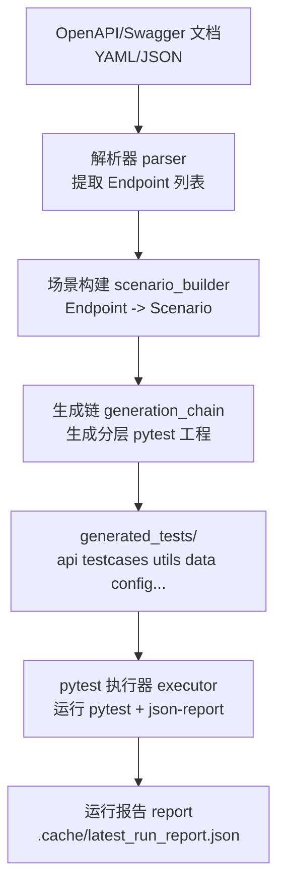
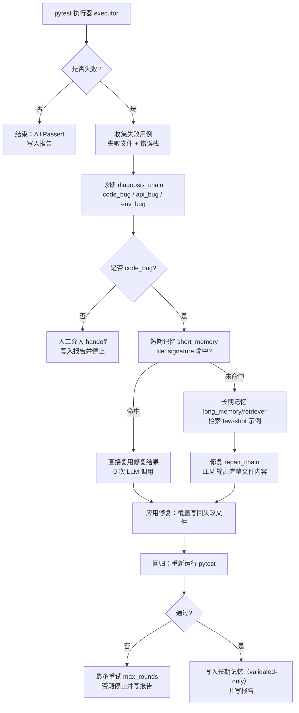

# API Test Agent Pro

一个面向测开 / SDET 的工具：从 OpenAPI/Swagger 文档自动生成分层 pytest 接口自动化工程，执行失败后进入自动自愈闭环（最多 3 轮、仅对 code_bug 修复）。支持短期记忆（同错复用、0 LLM 调用）与可选的长期记忆（ChromaDB，validated-only）。

## 能力概览

- OpenAPI/Swagger 解析：从 YAML/JSON 提取接口信息，构建 Endpoint 列表
- 场景构建：按资源聚合接口，生成 CRUD 场景（Scenario）
- 分层工程生成：输出 `api/ testcases/ utils/ data/ config/ reports/ + conftest.py + pytest.ini`
- pytest 执行与失败收集：封装执行器并解析 `pytest-json-report`
- 自愈闭环：失败分类 → 短期/长期记忆检索 → LLM 重写失败测试文件 → 回归验证
- 入口与展示：Click CLI + Streamlit 看板（一键流水线）+ **Claude Code Skill 集成**
- 可复现实验环境：内置 `mock_api_server.py` + `data/petstore.yaml`

---

## 这个项目到底干了什么

你可以把它理解成一个“接口自动化工程生成器 + 失败自愈引擎”：

1. **读懂接口文档**：把 OpenAPI/Swagger 文档解析成结构化的 Endpoint 列表（method/path/params/body/responses）
2. **组织可执行的测试场景**：按资源聚合接口，把同一资源的 CRUD 组合成可跑通的 Scenario（避免孤立接口测试没有前置数据）
3. **生成分层 pytest 工程**：自动落盘生成一套“像企业框架”的目录结构（`api/ + testcases/ + utils/ + data/ + config/`）
4. **运行 pytest 并收集失败上下文**：统一捕获失败用例、失败文件路径、错误栈、stdout/stderr
5. **失败分类与自愈闭环（可选）**：
   - 如果是 `env_bug`（如服务没启动、端口不通）→ 不修代码，直接提示人工处理
   - 如果是 `api_bug`（如接口返回与文档不一致）→ 不修测试代码，输出 handoff
   - 如果是 `code_bug`（测试代码自身问题）→ 进入修复循环：短期记忆命中则直接复用，否则检索长期记忆 few-shot，再调用 LLM 重写失败测试文件，回归通过才写入长期记忆

---

## 流程图

### 1) 生成链路（Generate）



### 2) 自愈闭环（Heal）



---

## Claude Code Skill 用法（推荐 ⭐）

本项目已内置 Claude Code Skill，你可以在 Claude Code 中以自然语言驱动整个测试流程，无需手动记忆 CLI 命令。

### 什么是 Claude Code Skill？

Skill 是 Claude Code 的扩展机制。本项目将 CLI 能力封装为 Skill 后，Claude 能自动完成以下工作：

- ✅ 检查环境是否就绪（依赖、.env、mock 服务）
- ✅ 根据你的自然语言意图，选择合适的命令和参数
- ✅ 解读运行结果和修复报告，用中文总结给你
- ✅ 遇到错误时自动排查（如端口占用、API key 未配置等）

### 如何激活

Skill 文件位于 `.claude/skills/api-test-agent/SKILL.md`，打开本项目后 Claude Code 会自动发现。你有 **三种方式** 触发：

#### 方式一：斜杠命令

在 Claude Code 对话中直接输入：

```
/api-test-agent
```

Skill 激活后，Claude 会进入 API 测试专家模式，理解后续所有测试相关的指令。

#### 方式二：自然语言描述（推荐）

直接用中文说出你想做的事，Claude 会自动匹配并激活 Skill：

| 你说的话                                          | Claude 做的事                                                          |
| ------------------------------------------------- | ---------------------------------------------------------------------- |
| "帮我从 petstore.yaml 生成测试"                   | 执行 `python cli.py generate -i data/petstore.yaml -o generated_tests` |
| "运行测试并自动修复失败的用例"                    | 执行 `python cli.py heal -t generated_tests`，并解读修复结果           |
| "看看上次测试报告"                                | 执行 `python cli.py report`，以表格/摘要呈现                           |
| "启动 Streamlit 看板"                             | 执行 `python -m streamlit run app.py`，并告知访问地址                  |
| "从 swagger.json 生成测试，用 deepseek-chat 模型" | 带参数执行，覆盖默认模型配置                                           |

#### 方式三：完整流水线（端到端）

一条指令走完整个流程：

```
/api-test-agent

帮我执行完整流水线：
1. 用 data/petstore.yaml 生成测试到 generated_tests/
2. 先确认 mock 服务在 localhost:8000 是否活着，没活就先启动
3. 执行 heal：跑 pytest，失败就自动修复
4. 最后给我一份人类可读的修复报告
```

Claude 会**逐步执行并汇报每步结果**，你不需要操心命令细节。

### 典型对话示例

```
👤 用户：帮我看看 petstore API 的测试覆盖率怎么样

🤖 Claude：
  好的，我来走完整流水线：
  1. 先检查 mock 服务 → ✅ localhost:8000 正常
  2. 生成测试工程 → ✅ 生成了 8 个测试文件
  3. 执行 pytest → ❌ 3 passed, 2 failed
  4. 分析失败原因 → 1 个是 schema 不匹配（code_bug），1 个是网络超时（env_issue）
  5. 修复 code_bug → ✅ 重写后通过
  6. 回归验证 → ✅ 4 passed, 1 skipped（env_issue 跳过）

  📊 最终：4/5 通过，1 个因环境问题跳过
  📄 修复了 1 个 bug：test_get_pet_by_id.py 中的响应断言字段名错误
```

### Skill 能调用的完整命令

| 命令                             | 说明                           | 示例                                                              |
| -------------------------------- | ------------------------------ | ----------------------------------------------------------------- |
| `python cli.py generate`         | 从 OpenAPI 文档生成测试工程    | `python cli.py generate -i data/petstore.yaml -o generated_tests` |
| `python cli.py heal`             | 执行测试并对 code_bug 自动修复 | `python cli.py heal -t generated_tests -r 3`                      |
| `python cli.py report`           | 查看最近一次运行报告           | `python cli.py report`                                            |
| `python -m streamlit run app.py` | 启动可视化看板                 | `python -m streamlit run app.py`                                  |
| `python mock_api_server.py`      | 启动本地 mock 后端             | `python mock_api_server.py`                                       |

---

## 快速开始（手动 CLI 模式）

如果你更习惯直接在终端操作，以下是手动流程。

### 0) 准备环境

- Python：3.10+（推荐）
- Windows / macOS / Linux 均可

### 1) 安装依赖

```bash
python -m pip install -r requirements.txt
```

### 2) 启动本地 mock 服务（推荐先做）

本项目默认用 `data/petstore.yaml` 演示，测试请求的 `base_url` 期望为 `http://localhost:8000`。先把 mock 启动起来，后面所有命令都能稳定验收：

```bash
python mock_api_server.py
```

验证 mock 正常：

```bash
python -c "import requests; print(requests.get('http://127.0.0.1:8000/pets').status_code)"
```

### 3) 配置环境变量（可选但推荐）

复制 `.env.example` 为 `.env`。

如果你使用 `DeepSeek API`（OpenAI 兼容协议），推荐直接这样配置：

```env
OPENAI_API_KEY=your_deepseek_api_key
OPENAI_BASE_URL=https://api.deepseek.com
```

默认模型已配置为 `deepseek-v4-pro`。

说明（和当前实现保持一致）：

- 本项目的聊天模型通过 `langchain_openai.ChatOpenAI` 走 OpenAI 兼容协议接入 `DeepSeek`
- 如果你只配置 `DeepSeek`，长期记忆中的向量检索会自动降级为 no-op，不影响生成和修复主流程（仍可写入/按元数据兜底检索）
- 如果你还想启用长期记忆检索，可额外配置一个支持 embedding 的服务：`EMBEDDING_API_KEY`、`EMBEDDING_BASE_URL`、`EMBEDDING_MODEL`

### 4) 生成分层测试工程

```bash
python cli.py generate -i data/petstore.yaml -o generated_tests
```

生成完成后，你会得到类似结构（示意）：

```text
generated_tests/
├── api/
├── config/
├── data/
├── reports/
├── testcases/
├── utils/
├── conftest.py
└── pytest.ini
```

### 5) 执行 pytest（只执行，不修复）

```bash
python -m pytest generated_tests -q
```

### 6) 执行并自动修复（最多 3 轮）

当且仅当 pytest 失败且被识别为 `code_bug` 时，才会进入修复循环：

```bash
python cli.py heal -t generated_tests
```

---

## 项目结构

### 核心源码

| 路径                                     | 说明                                                                 |
| ---------------------------------------- | -------------------------------------------------------------------- |
| `lang_agent/`                            | 核心逻辑（解析、场景、生成链、自愈链、执行器、记忆、LangGraph 编排） |
| `cli.py`                                 | Click 命令行入口（generate / heal / report）                         |
| `app.py`                                 | Streamlit 看板入口（一键流水线 / 仅生成 / 仅自愈 / 最近报告）        |
| `mock_api_server.py`                     | 本地可复现 mock 后端（用于验收闭环）                                 |
| `config.yaml`                            | 默认配置（模型、base_url、修复轮数、记忆开关）                       |
| `config.long_memory.yaml`                | 启用长期记忆的配置参考                                               |
| `data/`                                  | 示例 OpenAPI 文档（默认 `petstore.yaml`）                            |
| `tests/`                                 | 本项目自身的单元测试（不是生成的接口测试）                           |
| `.claude/skills/api-test-agent/SKILL.md` | Claude Code Skill 定义文件                                           |

### 自动生成产物

- `generated_tests/`：自动生成的分层 pytest 工程（建议不提交 Git，随时可删后重生成）
- `.cache/`：运行报告与短期记忆缓存（可删）
- `.chroma_acceptance/`：长期记忆验收用 Chroma 数据（可删）

---

## CLI 用法（参考）

### 生成

```bash
# 基础用法
python cli.py generate -i data/petstore.yaml -o generated_tests

# 指定 base_url 和模型
python cli.py generate -i data/petstore.yaml -o generated_tests --base-url https://api.example.com --model-name deepseek-chat
```

### 自愈

```bash
# 对已有测试工程执行自愈
python cli.py heal -t generated_tests

# 先生成再自愈（一条命令）
python cli.py heal -i data/petstore.yaml -t generated_tests

# 指定最大修复轮数和启用长期记忆
python cli.py heal -t generated_tests -r 5 --enable-long-memory
```

### 查看最近一次报告

```bash
python cli.py report
```

---

## Streamlit 看板

```bash
python -m streamlit run app.py
```

打开页面后建议用：

- 一键流水线：OpenAPI → Generate → pytest →（失败则 heal）→ 报告

---

## 配置说明

`config.yaml` 中的关键配置项：

| 配置项                      | 说明                       | 默认值                  |
| --------------------------- | -------------------------- | ----------------------- |
| `openapi_path`              | 默认 OpenAPI 文档路径      | `data/petstore.yaml`    |
| `base_url`                  | API 服务地址               | `http://localhost:8000` |
| `output_dir`                | 测试工程输出目录           | `generated_tests`       |
| `model.provider`            | LLM 提供商                 | `openai`                |
| `model.name`                | 模型名称                   | `deepseek-v4-pro`       |
| `model.temperature`         | 生成温度                   | `0`                     |
| `heal.max_rounds`           | 最大修复轮数               | `3`                     |
| `memory.enable_long_memory` | 是否启用 ChromaDB 长期记忆 | `false`                 |

所有配置项都可以通过 CLI 参数覆盖。

---

## 常见问题（Troubleshooting）

### 1) 无法连接到 localhost:8000 / 目标计算机拒绝连接

原因：mock 服务或你的真实后端没有启动。  
处理：

- 先运行 `python mock_api_server.py`
- 或把 `config.yaml` / Streamlit 侧边栏的 `base_url` 改成你的真实服务地址

### 2) invalid_api_key / 401

原因：`OPENAI_API_KEY` 未配置或不正确。  
处理：检查 `.env` 中的 `OPENAI_API_KEY` 与 `OPENAI_BASE_URL`，并确认模型名称配置正确。

### 3) 生成物里出现老的平铺 test_xxx.py

原因：你本地残留了旧的 `generated_tests/` 产物。  
处理：删除整个 `generated_tests/` 后重新 generate。

### 4) Claude Code 中 Skill 没有被识别

原因：Claude Code 需要重新加载项目才能发现新 Skill。  
处理：重启 Claude Code 会话，或在项目根目录重新打开。确保 `.claude/skills/api-test-agent/SKILL.md` 文件存在。

### 5) Claude Code Skill 执行命令报错

原因：Claude 的工作目录可能不在项目根目录。  
处理：在对话中明确告诉 Claude "请先 cd 到项目目录"，或使用绝对路径。

---

## 开发者验证

运行项目自测：

```bash
pytest tests -q
```
