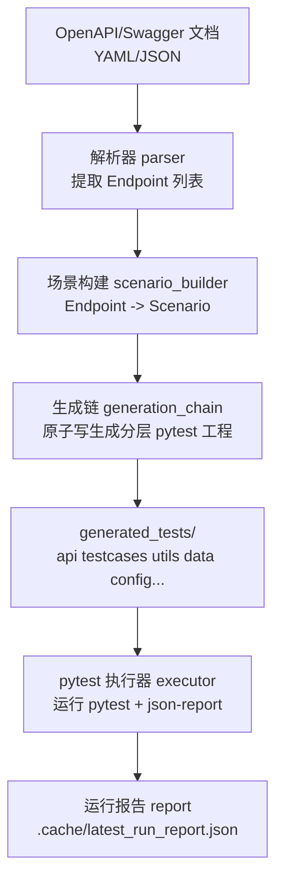
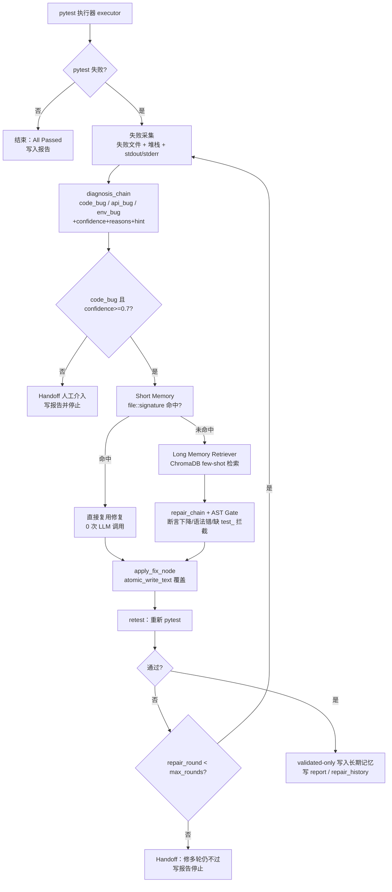

# API Test Agent Pro · 接口测试自动生成 + 自愈 Agent

<div align="center">


> 从一份 **OpenAPI / Swagger 文档** → 自动生成分层 pytest 工程 → 执行失败 → 分类 → 自动自愈，端到端的接口自动化 + LLM 自修复 Agent。

</div>

---

## 目录（Table of Contents，可选）

- [1. 这个项目干了什么](#1-这个项目干了什么)
- [2. 项目简介](#2-项目简介)
- [3. 项目背景 / 解决什么问题](#3-项目背景--解决什么问题)
- [4. 功能特性](#4-功能特性)
- [5. 架构与流程图](#5-架构与流程图)
- [6. 快速开始](#6-快速开始)
- [7. 使用示例](#7-使用示例)
- [8. 配置说明](#8-配置说明)
- [9. 项目结构](#9-项目结构)
- [10. 技术栈](#10-技术栈)
- [11. 测试](#11-测试)

---

## 1. 这个项目干了什么

一句话：**只要给它一份接口文档，它就能帮你自动生成一套可以直接跑的接口自动化工程，失败了还能自己判断是哪里错了，并在它有把握的时候自动修测试代码，最后给你一份结构化的报告。**

更具体地说，它会依次完成下面 6 件事：

1. 读 `openapi.yaml / swagger.json` → 解析接口定义 → 按资源组装 CRUD 场景
2. 生成一套企业级分层的 **pytest 工程**（`api / testcases / utils / data / config / reports / conftest.py / pytest.ini`）
3. 执行 pytest，结构化采集失败用例、失败文件、行号、堆栈、stdout/stderr
4. 失败分三类诊断：`code_bug / api_bug / env_bug`，并给出置信度 confidence、原因 reasons、可操作提示 actionable_hint
5. **只对高置信度的 code_bug** 进入自动修复：短期记忆（同错 0 次 LLM）→ 长期记忆 ChromaDB few-shot → LLM 重写失败文件 → 回归验证，最多 3 轮
6. 回归通过才写入长期记忆（validated-only），并通过 CLI、Streamlit、Claude Code Skill 暴露同一份结构化报告。

整个自愈内核用 **LangGraph 状态机** 编排，支持门控、熔断、handoff（不确定就不乱修）。

---

## 2. 项目简介

API Test Agent Pro 是一个面向 **SDET / 测开工程师 / AI Infra 开发者** 的工具：

- 对内：帮助你在分钟级落地接口自动化
- 对外：把"写用例 + 维护失败用例"这件事从人力密集型，变成"生成 + AI 自愈闭环"；
- 工程化：生成、执行、诊断、记忆、修复、展示都有清晰边界：能修的修，不能修的交人，绝不越界；
- 适合作为校招 SDET、接口自动化 × LLM Agent 的作品集项目。

---

## 3. 项目背景 / 解决什么问题

传统接口自动化有 4 个真实痛点，本项目对症下药：

| 痛点                                                     | 本项目的解法                                                                                                                    |
| -------------------------------------------------------- | ------------------------------------------------------------------------------------------------------------------------------- |
| **写用例太慢**：新接口一出来，testcase 一个一个写要一周  | `OpenAPI → Scenario → pytest` 一键生成，按资源聚合 CRUD 场景，秒出工程                                                          |
| **维护成本高**：接口一迭代，用例批量失败，人工逐个修     | **LLM 自愈闭环**：code_bug 自修，最多 3 轮 + 记忆沉淀，下次同错直接命中                                                         |
| **越修越可恶**：LLM 改错比没修还糟，断言被削弱还看不出来 | **三层保护**：诊断置信度门控（<0.7 不进修复） + 修复 AST 门控（断言少了 / 没测函数 / 语法错直接拦截） + 原子写（不会写坏文件）  |
| **报错看不懂**：堆栈 + 乱码，新人根本不知道下一步做什么  | **统一异常体系 + 可操作 user_hint**：解析器、执行器、LLM、门控都抛结构化错误，runner 兜底写 handoff_report，CLI/UI 直接念给人听 |

面试叙事：它不是"让 GPT 改代码的玩具脚本"，而是一套"生成 + 执行 + 诊断 + 门控 + 记忆 + 展示"边界清晰的 Agent Harness——边界就是：能修就修，修不了就交给人，绝对不让系统越界。

---

## 4. 功能特性

- ✅ **OpenAPI/Swagger 解析**：YAML/JSON 自动提取 method/path/params/body/responses，自动构造 Endpoint 列表
- ✅ **场景构建**：按资源聚合 CRUD（例如 `/pets` 资源 create → get → list → update → delete），避免孤立接口无前置数据
- ✅ **分层 pytest 工程生成**：输出 `api/ testcases/ utils/ data/ config/ reports/ conftest.py pytest.ini`，和企业自动化框架结构一致
- ✅ **结构化失败采集**：`pytest-json-report` → 失败用例、失败文件路径、行号、堆栈、stdout/stderr 全部结构化
- ✅ **三类失败诊断**：code_bug（用例本身问题） / api_bug（接口返回与文档不一致） / env_bug（服务没起 / 网络 / 鉴权）
- ✅ **诊断置信度 + 可操作提示**：每次诊断都带 `confidence / reasons / actionable_hint`，低置信直接 handoff
- ✅ **短期记忆 Short Memory**：同一文件 + 同一错误签名 → 直接复用上次修复，**0 次 LLM 调用**
- ✅ **长期记忆 Long Memory**：ChromaDB 向量检索 validated-only 的修复案例作为 few-shot，越修越聪明
- ✅ **修复门控 AST Guardrails**：断言数量下降 / 缺 `def test_` 函数 / 语法错误 → **拒绝落盘**
- ✅ **原子写防半写**：生成和修复的文件落盘全部 `tempfile + fsync + os.replace`，中途 Ctrl+C 不毁文件
- ✅ **统一异常 + Handoff 报告**：所有关键错误转成结构化的 handoff_report，异常时也写 `latest_run_report.json`
- ✅ **三种入口**：Click CLI / Streamlit 看板 / **Claude Code Skill**（推荐，自然语言直接驱动）
- ✅ **可复现实验环境**：内置 `mock_api_server.py` + `data/petstore.yaml`，clone 即可演示

---

## 5. 架构与流程图

### 整体架构分层

```text
┌───────────────────────────────────────────────────────────────────────────┐
│                        入口层 Entry Layer                                  │
│   CLI (cli.py)   Streamlit (app.py)   Claude Code Skill                │
└───────────────────────────────────────┬───────────────────────────────────┘
                                        │ invoke
                                        ▼
┌───────────────────────────────────────────────────────────────────────────┐
│                  Agent Harness（LangGraph）                               │
│  runner.py   │   nodes.py    │   router.py   │   state.py              │
│  编排 & 异常兜底    原子节点执行      分支路由       共享状态              │
└───────────────┬───────────────┼───────────────┼─────────────────────────┘
                │ 解析/生成/执行/诊断/修复    │ 记忆检索
                ▼                         ▼
┌─────────────────────────────┐  ┌──────────────────────────────┐
│    Chains 能力链            │  │   Memory Layer 记忆层         │
│ parser / generation         │  │ short_memory（错误签名 KV）   │
│ diagnosis_ / repair         │  │ long_memory（ChromaDB 向量）  │
│ executor / signatures      │  │ retriever（few-shot 召回）    │
└─────────────────────────────┘  └──────────────────────────────┘
                │
                ▼
┌───────────────────────────────────────────────────────────────────────────┐
│                    产物 & 报告 Artifacts                                    │
│  generated_tests/（分层 pytest 工程）                                     │
│  .cache/latest_run_report.json   handoff_report   repair_history       │
└───────────────────────────────────────────────────────────────────────────┘
```

### 5.1 生成链路（Generate）



### 5.2 自愈闭环（Heal）



---

## 6. 快速开始

### 6.0 环境要求

- Python **3.10** 及以上
- Windows / macOS / Linux 均可
- （可选）一个 OpenAI 兼容协议的 API Key（推荐 DeepSeek）

### 6.1 安装依赖

```bash
python -m pip install -r requirements.txt
```

### 6.2 启动本地 mock 服务（推荐先做）

本项目用 `data/petstore.yaml` 演示，`base_url` 默认期望 `http://localhost:8000`。先把 mock 起起来：

```bash
python mock_api_server.py
```

另开一个终端验证 mock 正常：

```bash
python -c "import requests; print(requests.get('http://127.0.0.1:8000/pets').status_code)"
```

### 6.3 配置环境变量（可选但推荐）

复制 `.env.example` 为 `.env`：

```env
# DeepSeek（OpenAI 兼容协议）
OPENAI_API_KEY=sk-xxxx
OPENAI_BASE_URL=https://api.deepseek.com

# 可选：启用向量长期记忆时再配
# EMBEDDING_API_KEY=...
# EMBEDDING_BASE_URL=...
# EMBEDDING_MODEL=...
```

> 💡 不配置 LLM 也可以：\*\*生成链路 100% 纯规则，不依赖任何 LLM；只有 heal 链路中 "short_memory 没命中"的新错误才需要 LLM，此时会统一报 `LLMUnavailableError` 并写 handoff 报告。

### 6.4 一键生成 + 自愈

```bash
# 先生成分层 pytest 工程
python cli.py generate -i data/petstore.yaml -o generated_tests

# 再执行 + 失败自动自愈
python cli.py heal -t generated_tests
```

### 6.5 查看最近一次报告

```bash
python cli.py report
```

报告真实文件就在 `.cache/latest_run_report.json`，Streamlit 和 Skill 都是读这同一份。

---

## 7. 使用示例

### 示例 1：手动 CLI 端到端

```bash
# 1) 生成并指定 base_url 写死为 mock 的 8000
python cli.py generate -i data/petstore.yaml -o generated_tests --base-url http://localhost:8000

# 生成的分层结构（生成后应看到）
# generated_tests/
# ├── api/  config/  data/  reports/  testcases/  utils/
# ├── conftest.py  pytest.ini

# 2) 纯跑一次 pytest（不自愈）
python -m pytest generated_tests -q

# 3) 失败就自动修，最多 5 轮，并启用长期记忆
python cli.py heal -t generated_tests -r 5 --enable-long-memory
```

### 示例 2：故意触发异常 → 看结构化 handoff 报告

```bash
# 输入文件不存在
python cli.py generate -i data/not_exists.yaml -o generated_tests 2>&1 || true

# 查看结构化报告
python -c "import json, lang_agent.report as r; print(json.dumps(r.load_run_report(), indent=2, ensure_ascii=False))"
```

期望字段：

```json
{
  "ok": false,
  "stopped_reason": "stopped_on_env_bug",
  "handoff_report": {
    "category": "env_bug",
    "error_type": "OpenAPIParserError",
    "reason": "请检查输入文件是否存在且为合法的 OpenAPI 3.x 文档...",
    "details": { "path": "..." }
  }
}
```

### 示例 3：Streamlit 可视化看板

```bash
python -m streamlit run app.py
```

进页面后点左侧选 `data/petstore.yaml` → 点**一键流水线**，自愈过程、修复轮次、handoff 信息全部可视化。

### 示例 4：Claude Code Skill（推荐 ⭐）

在 Claude Code 中直接说：

> 帮我用 `data/petstore.yaml` 走完整流水线：先启动 mock 服务，再生成测试到 `generated_tests/`，如果失败就自动修，最后给我一份中文报告。

Skill 路径：`.claude/skills/api-test-agent/SKILL.md`，打开项目会被 Claude Code 自动发现。

---

## 8. 配置说明

`config.yaml` 默认配置（所有字段都能被 CLI 参数覆盖）：

| 配置项                      | 说明                                 | 默认值                          |
| --------------------------- | ------------------------------------ | ------------------------------- |
| `openapi_path`              | 默认 OpenAPI 文档路径                | `data/petstore.yaml`            |
| `base_url`                  | 被测 API 服务地址                    | `http://localhost:8000`         |
| `output_dir`                | 生成的 pytest 工程目录               | `generated_tests`               |
| `model.provider`            | LLM 提供商（当前仅实现 openai 兼容） | `openai`                        |
| `model.name`                | 聊天模型名                           | `deepseek-v4-pro`               |
| `model.temperature`         | 生成温度（修复建议保持 0）           | `0`                             |
| `heal.max_rounds`           | 单失败最多自愈轮数（熔断）           | `3`                             |
| `memory.enable_long_memory` | 是否启用 ChromaDB 向量长期记忆       | `false`                         |
| `memory.long_memory_path`   | 长期记忆本地存储路径                 | `.chroma_acceptance`            |
| `memory.short_memory_path`  | 短期记忆 JSON 路径                   | `.cache/short_memory.json`      |
| `report.path`               | 运行报告落盘路径                     | `.cache/latest_run_report.json` |

如需启用长期记忆，可直接参考 `config.long_memory.yaml`（它提供了 embedding 相关的完整配置示例）。

---

## 9. 项目结构

```text
api_test_agent_02/
├── lang_agent/                          # ⭐ 核心内核（业务内核 + 横切能力解耦）
│   ├── chains/                          # 业务能力链（Parser之后、生成/诊断/修复之前的编排）
│   │   ├── generation_chain.py          #   分层工程生成 + 原子写
│   │   ├── diagnosis_chain.py           #   三类诊断 + confidence / reasons / hint
│   │   ├── repair_chain.py              #   LLM 修复 + AST 门控 + apply_repair_to_file
│   │   └── scenario_builder.py          #   Endpoint → CRUD 链 + 单接口 Scenario
│   ├── graph/                           # LangGraph 编排（状态机 + 路由 + 异常兜底）
│   │   ├── runner.py                    #   编译 Generate / Heal 图 + run_* 入口 + 异常兜底写 handoff
│   │   ├── nodes.py                     #   parse / build_scenarios / run_tests / classify / retest ...
│   │   ├── router.py                    #   四类路由 + code_bug 置信度<0.7 → handoff
│   │   └── state.py                     #   AgentState（含 diagnosis_* 三字段）
│   ├── memory/                          # 双层记忆
│   │   ├── short_memory.py              #   file::error_signature → fix_code KV
│   │   ├── long_memory.py               #   ChromaDB（validated-only 写入）
│   │   └── retriever.py                 #   few-shot 召回
│   ├── io/                              # ⭐ 横切：IO / 边界层（外部世界读写的副作用集中）
│   │   ├── parser.py                    #   OpenAPI → list[Endpoint]，无 Prance 纯 YAML 兜底
│   │   ├── executor.py                  #   宿主机 pytest 子进程 + 结构化失败 + TestRunnerError
│   │   ├── report.py                    #   RunReport / HealReport / RepairHistoryEntry / load save
│   │   └── sandbox/                     #   ⭐ 预留安全执行层：P1 接入 HostExecutor / DockerExecutor / policy
│   ├── llm/                             # ⭐ 横切：模型供应商与 Prompt（可替换）
│   │   ├── factory.py                   #   build_chat_llm / build_embeddings（DeepSeek Embedding 自动降级）
│   │   └── prompts.py                   #   generation / diagnosis / repair 三条 prompt
│   └── core/                            # ⭐ 横切：通用底座（零业务依赖）
│       ├── config.py                    #   yaml + env + CLI overrides 合并 → Settings
│       ├── signatures.py                #   行号/指针归一化 + 300字稳定错误签名
│       └── utils.py                     #   atomic_write_text + BaseSelfHealingError 五种子类
├── tests/                               # 项目本身的单元/回归测试（不是生成的接口测试）
│   ├── test_parser.py
│   ├── test_report.py
│   ├── test_router.py                   # 含置信度 handoff 门控用例
│   ├── test_signatures.py
│   ├── test_long_memory.py
│   └── test_utils_robustness.py         # ⭐ 原子写 / handoff_report 用例
├── data/                                # 示例 OpenAPI 文档
│   ├── petstore.yaml
│   └── todo_demo.yaml
├── docs/                                # 架构与设计沉淀（面试直接打开看）
│   ├── 21天复写计划-API-Test-Agent.md   # 面试 21 天学习 & 复写路线
│   ├── architecture.md                  # ⭐ 分层架构、Generate/Heal 数据流、门控熔断清单
│   └── design_decisions.md              # ⭐ 7 条 ADR：为什么 LangGraph、阈值为什么是 0.7...
├── .claude/skills/api-test-agent/       # Claude Code Skill 定义
├── cli.py                               # Click CLI：generate / heal / report
├── app.py                               # Streamlit 可视化看板
├── mock_api_server.py                   # 本地可复现 mock 后端
├── config.yaml                          # 默认配置
├── config.long_memory.yaml              # 长期记忆配置参考
├── requirements.txt
├── pytest.ini
├── .env.example
└── README.md
```

### 生成产物目录（可删、随时能重新生成，不进仓库）

- `generated_tests/`：对外产出的分层 pytest 工程（CLI 默认输出路径，后续统一到 `output/generated/`）
- `.cache/`：运行报告、短期记忆缓存、pytest json-report
- `.chroma_acceptance/`：长期记忆向量库（启用长期记忆时自动生成）

> 架构与决策沉淀见独立文档：[architecture.md](docs/architecture.md) 与 [design_decisions.md](docs/design_decisions.md)。

---

## 10. 技术栈

| 分类         | 技术 / 库                             | 作用                                         |
| ------------ | ------------------------------------- | -------------------------------------------- |
| Agent 编排   | **LangGraph**                         | 自愈状态机、条件路由、轮次熔断、handoff      |
| Prompt / LLM | **LangChain + langchain-openai**      | 诊断链、修复链、ChatOpenAI 兼容入口          |
| 长期记忆     | **ChromaDB**                          | validated-only 向量库 + few-shot 召回        |
| 解析         | **Prance**                            | OpenAPI/Swagger 校验与解析（支持 YAML/JSON） |
| 执行引擎     | **pytest + pytest-json-report**       | 用例执行 + 结构化失败采集                    |
| 重试兜底     | **tenacity**                          | LLM 调用、网络不稳定重试装饰器               |
| CLI          | **Click**                             | generate / heal / report 子命令              |
| 可视化       | **Streamlit**                         | 一键流水线看板、报告展示                     |
| 配置         | **PyYAML + python-dotenv + Pydantic** | `config.yaml` + `.env` 加载                  |
| HTTP         | **requests**                          | mock 验证与生成的测试接口层                  |
| Agent 交互   | **Claude Code Skill**                 | 自然语言驱动整条流水线                       |

---

## 11. 测试

这里的 `tests/` 是**项目本身的单元/回归测试**（测 parser、router、report、long_memory、signatures、robustness 等），**不是**对外生成的接口用例。

### 11.1 运行

```bash
pytest tests -q
```

当前基线：**13 passed**（2026-09-10，commit `f3a5b42` 之后）。

### 11.2 测试覆盖的关键能力

| 模块      | 用例文件                         | 覆盖点                                                                                    |
| --------- | -------------------------------- | ----------------------------------------------------------------------------------------- |
| 解析器    | `tests/test_parser.py`           | 读取 YAML/JSON、Endpoint 提取                                                             |
| 报告      | `tests/test_report.py`           | RunReport save/load、序列化                                                               |
| 路由      | `tests/test_router.py`           | 分类、置信度 handoff、重试与 max_rounds 熔断                                              |
| 签名      | `tests/test_signatures.py`       | 错误签名 hash、稳定性                                                                     |
| 长期记忆  | `tests/test_long_memory.py`      | validated-only 写入、兜底检索、降级 no-op                                                 |
| 健壮性 ⭐ | `tests/test_utils_robustness.py` | 原子写覆盖一致性、写失败保留原文件+清理临时文件、父目录不存在、异常转 handoff_report 落盘 |
